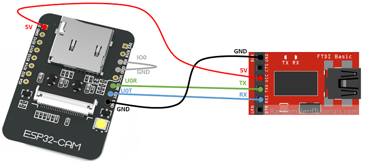

# VASTNet
#### ECE Capstone Project Fall 2021
---
The ESP32 cam is a low-cost module with both WiFi and Bluetooth capabilities.

We use a pre-trained Yolov3-tiny model for real-time object detection: a compressed version of Yolov3 to improve the model's efficiency and reduce its memory footprint.

## Hardware
----
The esp32cam Arduino library provides an easy-to-use API with a web server that displays video streams captured by the camera. 

The hardware we used is linked [here](https://www.amazon.com/KeeYees-ESP32-CAM-Bluetooth-Dual-core-Development/dp/B07S49STW4/ref=cm_cr_arp_d_product_top?ie=UTF8) and includes the chip, camera, FTDI USB to TTL Serial Converter, and jumper wires. 



Follow the instructions [here](https://randomnerdtutorials.com/esp32-cam-video-streaming-face-recognition-arduino-ide/) instructions on hardware pinout and how to run the Camera WebServer. 


## Installation 
------- 
Clone repository:

```git clone vastnet ```

Run real-time inference.
To view argument options add the ```--help``` flag.

```python3 inference.py --model_name=<model_name> ... ```


## Directories
-----

- Model config files are stored as ```darknet/cfg/<model_name>.cfg```
- Pre-trained weights files are stored as ```darknet/cfg/<model_name>.weights```
- Class names are stored in ```darknet/data/coco.names```


Model
------
| Model | Inference time | 
| ------ | ----------- | 
| yolov3   | ~400-600ms |
| yolov3-tiny   | ~40-60ms | 


## Useful Links 
------
- [Darknet Github](https://github.com/pjreddie/darknet)

- [Yolo-v3](https://pjreddie.com/darknet/yolo/)


## Troubleshooting
------

####Problem with Arduino Setup
- Be sure that the Arduino configurations are as follows: 

	- Board: ESP32 Wrover Module
	- Upload speed: 15200
	- Flash frequency: 40mhz
	- Flash mode: QIO
	- Partion scheme: Huge App
	- Uncomment the line ```#define CAMERA_MODEL_AI_THINKER``` in ```CameraWebServer.ino```
- Make sure you are using a static IP and entering a valid *ssid* and *password*. Ensure that there is no firewall. 

